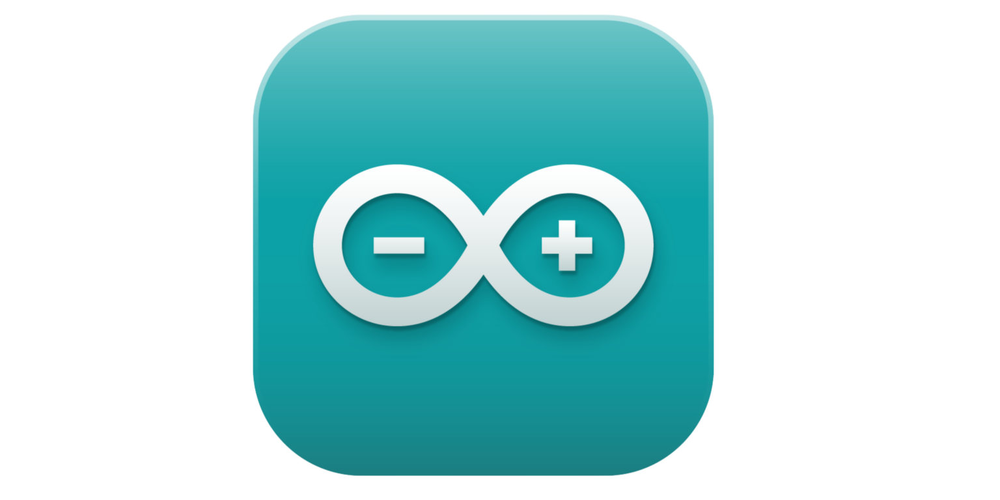
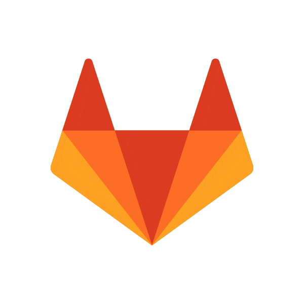

<!-- Header Section -->
<h1 align="center"><font face="Arial">Hi 👋, I'm Vedant Kawade</font></h1>
<h3 align="center"><font face="Arial"><a href="https://www.linkedin.com/in/vedant-kawade-09501b278/" target="_blank" rel="noreferrer">Vedant</a> is a passionate Python Enthusiast from India, working on AI/ML projects in college now. Feel free to reach out for any Projects related doubts.</font></h3>


```python
#!/usr/bin/python
# -*- coding: utf-8 -*-

import openai

class AI_ML_Enthusiast:
    def __init__(self):
        self.name = "Vedant Kawade"
        self.role = "AI/ML Enthusiast"
        self.language_spoken = ["mr_IN", "hi_IN", "en_IN"]

    def ai_greeting(self):
        prompt = f"Introduce yourself as {self.name}, an {self.role}, and welcome visitors."
        response = openai.ChatCompletion.create(
            model="gpt-3.5-turbo",
            messages=[{"role": "system", "content": "You are a friendly AI assistant."},
                      {"role": "user", "content": prompt}]
        )
        return response["choices"][0]["message"]["content"]

    def say_hi(self):
        print(self.ai_greeting())

me = AI_ML_Enthusiast()
me.say_hi()
```

<!-- GIF -->


<!-- Languages and Tools Section -->
<h3 align="left"><font size="+2" face="Verdana">Languages and Tools:</font></h3>


- I learn and work on AI/ML and everything around it.
- I’m learning as of now **python Projects**


#### Programming Language Stack
<p align="left">      <!-- --> <!--  --></p>

#### OS Stack
<p align="left">    

#### Tools 
<p align="left">
</p>

#### Project Management Stack
<p align="left">  </p>

#### Editor / IDE I ♥
<p align="left"> <!--  --> <!-- --></p>

<!-- Contact Section -->
<h3 align="left"><font size="+2" face="Verdana">Connect with me:</font></h3>
<p align="left">
</p>
<a href="https://github.com/VedantKawade3" target="_blank">

</a>
<a href="https://gitlab.com/VedantKawade3" target="_blank">

</a>
<a href="https://x.com/Vedant_Kawade07" target="_blank">

</a>
<a href="https://www.linkedin.com/in/vedant-kawade-09501b278/" target="_blank">

</a>
<a href="https://www.instagram.com/" target="_blank">

</a>
<a href="mailto:vedantkawade.official@gmail.com" target="_blank">

</a>

